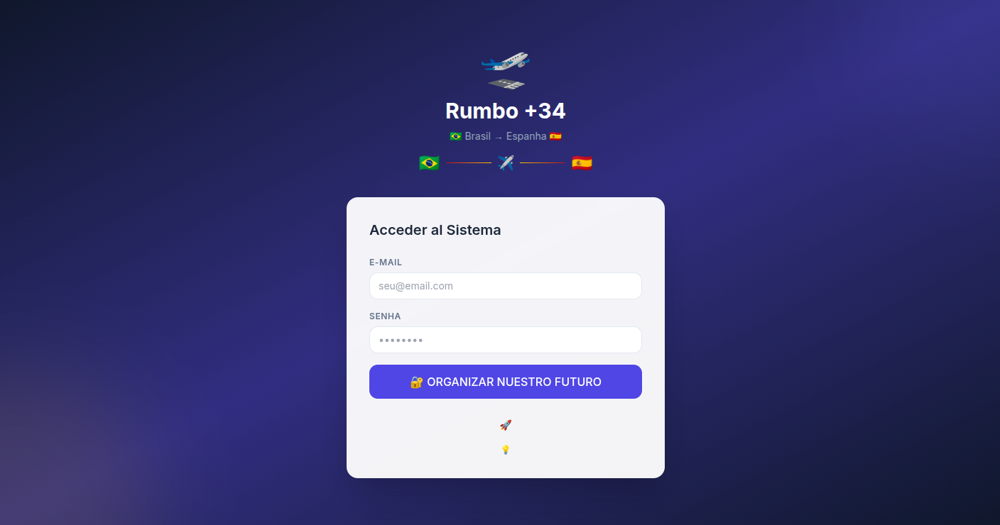
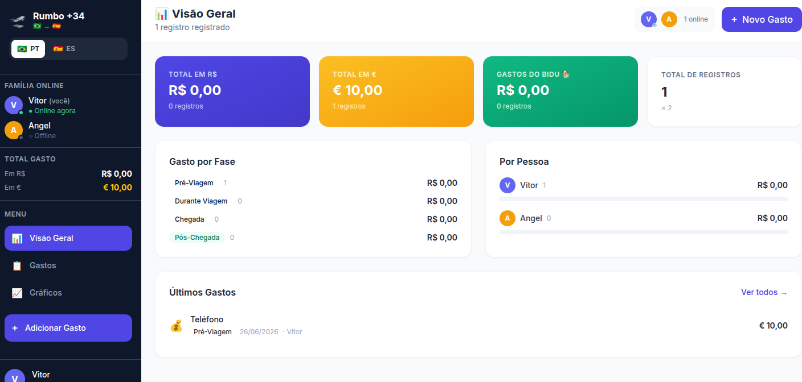

# 🛫 Rumbo +34

> **A collaborative dashboard to track every expense involved in moving from Brazil 🇧🇷 to Spain 🇪🇸.**
> Built for couples planning their immigration journey together, with real-time synchronization, multi-currency support, and detailed financial insights.

<p align="center">
  
  
  
  
  
  
  
</p>

---

## 🌍 Live Demo

🔗 **Application:** https://rumbo34.vercel.app/


---

## 📸 Preview


### Dashboard


<p align="center">
  
</p>

### Expense Management

<p align="center">
  
</p>

---

# ✨ Features

## 📊 Dashboard

* KPIs
* Total expenses
* Expenses by immigration stage
* Expenses by person
* Monthly evolution
* Remaining budget

## 📋 Expense Management

* Add
* Edit
* Delete
* Search
* Advanced filters
* Categories
* Immigration stages

## 📈 Analytics

* Pie Chart
* Bar Chart
* Timeline
* Expense distribution

## 👥 Collaboration

* Real-time synchronization
* Live Presence
* Instant notifications
* Two-user collaboration

## 💰 Financial Features

* BRL (R$)
* EUR (€)
* Automatic totals
* Currency separation

## 🐕

* Separate pet expenses
* Dedicated filters

## 🌐 User Experience

* Responsive Design
* Dark Mode
* Portuguese
* Spanish
* Mobile Friendly

## 🔐 Authentication

* Email & Password
* Email Verification
* Gmail SMTP
* Protected Routes
* Maximum of two users

---

# 🗂 Immigration Stages

| Stage              | Description                                      |
| ------------------ | ------------------------------------------------ |
| 🔵 Pre-Departure   | Documentation, flights and preparation in Brazil |
| 🟡 During the Trip | Travel expenses                                  |
| 🟣 Arrival         | First days in Spain                              |
| 🟢 Post-Arrival    | Housing, paperwork and settlement                |

---

# 📦 Expense Categories

* ✈️ Flights
* 🏠 Accommodation
* 🍽️ Food
* 📄 Documentation
* 🐕 Pet
* 💊 Healthcare
* 🚗 Transportation
* 📦 Luggage
* 👕 Clothing
* 💻 Electronics
* 🏛️ Consular Fees
* 📚 Courses
* 🛡️ Insurance
* 🏙️ Housing
* 💰 Others

---

# 🛠 Tech Stack

| Technology   | Description                          |
| ------------ | ------------------------------------ |
| Next.js 14   | React Framework (App Router)         |
| React 19     | Frontend                             |
| TypeScript   | Language                             |
| Tailwind CSS | Styling                              |
| Supabase     | Authentication + Database + Realtime |
| PostgreSQL   | Database                             |
| Recharts     | Charts                               |
| Vercel       | Hosting                              |

---

# ⚙️ Installation

Clone the repository:

```bash
git clone https://github.com/your-user/rumbo-34.git
```

Go to the project folder:

```bash
cd rumbo-34
```

Install dependencies:

```bash
npm install
```

Run the development server:

```bash
npm run dev
```

Open:

```
http://localhost:3000
```

---

# 🔑 Environment Variables

Create a `.env.local` file:

```env
NEXT_PUBLIC_SUPABASE_URL=your_supabase_url

NEXT_PUBLIC_SUPABASE_ANON_KEY=your_supabase_anon_key

SUPABASE_SERVICE_ROLE_KEY=your_service_role_key
```

---

# ⚙️ Supabase Configuration

After creating the project in Supabase:

* Enable **Authentication**.
* Configure **Email Authentication**.
* Disable public sign-ups if you want only two approved users.
* Configure Gmail SMTP.
* Enable Realtime.
* Create the required PostgreSQL tables.

---

# 📁 Project Structure

```
rumbo-34/
│
├── app/
├── components/
├── hooks/
├── lib/
├── public/
├── styles/
├── docs/
│   ├── dashboard.png
│   └── expenses.png
├── supabase/
├── README.md
└── package.json
```

---

# 🗺️ Roadmap

## Completed

* [x] Dashboard
* [x] Authentication
* [x] Real-time Sync
* [x] Notifications
* [x] Multi-language
* [x] Responsive Layout
* [x] Pet Expenses
* [x] Charts
* [x] Gmail SMTP

## Planned

* [ ] Budget planning
* [ ] Savings goal
* [ ] PDF reports
* [ ] Excel export
* [ ] Expense attachments
* [ ] Exchange rate history
* [ ] Progressive Web App (PWA)
* [ ] Mobile App

